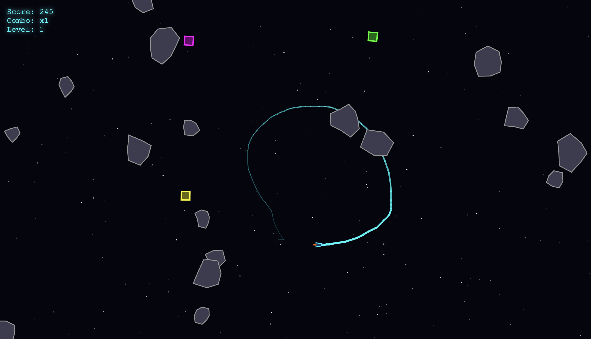

# Orbitaloop 🚀

A fast-paced space arcade game where you pilot a spaceship that leaves a glowing trail. Draw loops around asteroids to destroy them and survive as long as possible!



## 🎮 How to Play

1. **Move** your mouse to control the spaceship - it follows your cursor
2. **Draw loops** around asteroids by circling them with your trail
3. **Complete the circle** to destroy all asteroids caught inside
4. **Collect power-ups** to enhance your abilities
5. **Survive** as long as possible while your score increases!

## 🎯 Game Mechanics

- **Automatic Trail**: Your spaceship continuously leaves a glowing cyan trail
- **Trail Length**: Limited to 150 units initially (grows with power-ups)
- **Trail Fade**: Oldest parts of the trail fade away automatically
- **Loop Detection**: Cross your own trail to complete a loop and destroy asteroids inside
- **Difficulty**: Asteroids spawn faster and move quicker as levels increase

## 💎 Power-ups

- 🟢 **Trail Extension**: Permanently increases maximum trail length (+50 units)
- 🟡 **Speed Boost**: Move faster for 10 seconds
- 🔵 **Shield**: One-time protection from asteroid collision
- 🟣 **Score Multiplier**: Double points for 15 seconds

## 🎨 Features

- Smooth mouse-following spaceship controls
- Real-time loop detection system
- Particle effects and explosions
- Retro sci-fi sound effects
- Progressive difficulty system
- Combo multipliers for destroying multiple asteroids
- Animated starfield background

## 🚀 Quick Start

Simply open `index.html` in a modern web browser - no installation required!

```bash
# Clone the repository
git clone https://github.com/markwylde/orbitaloop.git

# Open in browser
open index.html
```

## 🛠️ Technical Details

- Built with **p5.js** game framework
- Pure JavaScript with no build process required
- Runs entirely in the browser
- Uses Web Audio API for sound generation
- Canvas-based rendering for smooth performance

## 🎮 Controls

- **Mouse Movement**: Control spaceship
- **Any Key**: Start game
- **R**: Restart after game over

